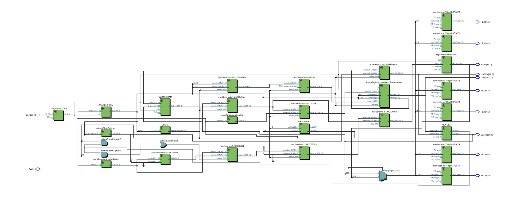

# Projeto 2 - Design de Computadores
### Alunos: Evandro Romeiro, Michel José Moraes, Rodrigo de Jesus
 

Este projeto é um processador RISC de 32 bits, compatível com o MIPS DLX.  

Para testes, o display de 7 segmentos mostra o valor do PC, ou o valor da ULA (Selecionado através do SWITCH 0).

### Switches
<ul>
  <li>SW 0: Seleciona o que é mostrado no display de 7 segmentos (PC quando 0 / ULA quando 1) </li>
</ul>

### Instruções:

#### Grupo A

##### As instruções de referência à memória:
<ul>

<li> lw - Carrega palavra ; </li>

<li> sw - Armazena palavra. </li>

</ul>

##### Instruções lógico-aritméticas:
<ul>

<li> add - Soma; </li> 

<li> sub - Subtração; </li> 

<li> AND - E lógico; </li> 

<li> OR - OU lógico; </li> 

<li> slt - Comparação menor que. </li> 

</ul>

##### Instruções de desvio:
<ul>
<li> beq - Desvio se igual; </li>

<li> j - Salto incondicional. </li>
</ul> 

#### Grupo B

##### Instrução de carga:
<ul>

<li> lui - Carrega imediato para 16 bits MSB. </li> 
</ul>

#### Instruções lógico-aritméticas:
<ul>

<li> addi - Soma com imediato; </li> 

<li> ANDI - E lógico com imediato; </li> 

<li> ORI - OU lógico com imediato; </li> 

<li> slti - Comparação menor que imediato. </li> 
</ul>

##### Instruções de desvio:
<ul>

<li> bne - Desvio se não igual; </li> 

<li> jal - Salto e conecta; </li> 

<li> jr - Salto por registrador. </li> 

</ul>

  

